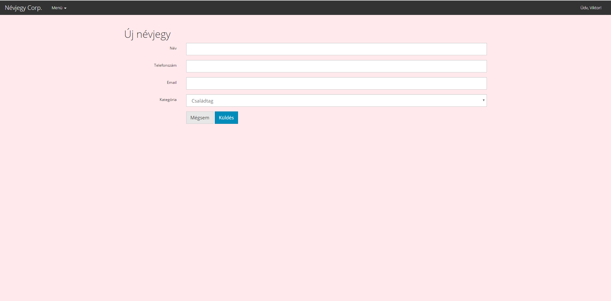

# Dokumentáció
## Névjegyek kezelése
Készítette: Kicsiny Viktor

###1. Követelményanalízis
####1.1 Célkitűzés
A névjegyeink egy helyen történő kezelése a legnagyobb egyszerűségre és kezelhetőségre törekedve.

######Funkcionális követelmények:
* Regisztráció
* Bejelentkezés
* Csak bejelentkezett felhasználók által elérhető funkciók
  - új névjegy létrehozása
  - a meglévő névjegyek szerkesztése
  - a meglévő névjegyek törlése

######Nem funkcionális követelmények:
*	**Használhatóság:** Felhasználóbarát, ergonomikus elrendezés és kinézet.
*	**Teljesítmény:** Gyors működés.
*	**Biztonság:** Jelszavak tárolása, funkciókhoz való hozzáférés.

#####1.2.	Szakterületi fogalomjegyzék
* **Névjegy:** egy névjegy, mely névvel, telefonszámmal, email címmel és kategóriákra bontható.
* **Szerkesztés:** egy névjegy adatainak megváltoztatása.
* **Törlés:** egy névjegy törlése az adatbázisból.

#####1.3.	Használatieset-modell, funkcionális követelmények

**Vendég**: Csak a publikus oldalakat éri el

*	Főoldal
*	Bejelentkezés
*	Regisztráció

**Bejelentkezett felhasználó**: A publikus oldalak elérésén felül egyéb funkciókhoz is hozzáfér.

*	Új névjegy létrehozása
*	Meglévő névjegy megtekintése
*	Meglévő névjegy szerkesztése
*	Meglévő névjegy törlése
* Kijelentkezés

Példa egy egyszerű folyamatra:

**Meglévő névjegy szerkesztése:**

1.	A felhasználó az oldalra érkezve, bejelentkezik vagy regisztrál
2.	Regisztráció után megtekintheti a névjegyeket listázó oldalt, ahol kiválaszthatja a szerkeszteni kívánt névjegyet.
3.	Rákattint a szerkeszteni kívánt névjegyre
4.	A megtekintés oldalon kiválaszthatja a „Szerkeszt” gombot
5.	Szerkesztés oldalon felviszi az új adatokat
6.	„Küldés” gombra kattintva elmenti a változásokat

###2.	Tervezés

#####2.1.	Architektúra terv

######2.1.1. Oldaltérkép:

**Publikus:**
* Főoldal
* Bejelentkezés
* Regisztráció

**Bejelentkezett:**
* Főoldal
* Új névjegy létrehozása
* Listaoldal  
  * Névjegy megtekintése
    * Névjegy szerkesztése 
    * Névjegy törlése

######2.1.2. Végpontok

* GET/: főoldal
* GET/login: bejelentkező oldal
* POST/login: bejelentkező adatok felküldése
* GET/register: regisztrációs oldal
* POST/register: regisztrációs adatok felküldése
* GET/logout: kijelentkező oldal
* GET/cards: névjegyek oldal
* GET/cards/create: új névjegy létrehozása
* POST/cards/create: új névjegy létrehozásához szükséges adatok felküldése
* GET/cards/id: névjegy adatok
* GET/cards/id/delete: névjegy törlése
* GET/cards/id/edit: névjegy szerkesztése
* POST/cards/id/edit: névjegy szerkesztése, adatok felküldése

#####2.2. Felhasználói-felület modell

######2.2.1.Oldalvázlatok:

**Főoldal**                                              

**Bejelentkező oldal**

**Regisztrációs oldal**

**Névjegyek megtekintése**

**Új névjegy létrehozása**

**Névjegy megtekint**

**Névjegy szerkesztése**

######2.2.2.Designtervek (végső megvalósítás kinézete):

**Főoldal**                                                 

**Bejelentkező oldal**

**Regisztrációs oldal**

**Új névjegy létrehozása**

**Névjegy megtekint**

**Névjegy szerkesztése**

######2.2.3. Osztálymodell
 
 **Adatmodell**  
 
 
###3.	Implementáció

######3.1.1. Fejlesztőkörnyezet

GitHub, Visual Studio Code

+ GitHub account létrehozása
+ GitHub repository létrehozása és klónozása (git clone)
+ Visual Studio Code beállítása
+ Megkezdhetjük a kódolást
+ Visual Studio Code-on belül lehetőségünk van a mentéseinket a git commit, git push parancsokkal frissíteni GitHub reponkat
+ Végezetül a GitHub oldalán leellenőrizhetjük a munkánkat

######3.1.2. Könyvtárstruktúra, funkciók

+ alkfejl-bead
  + app
    + Http
      + Controllers
        + CardController.js
        + UserController.js
      + kernel.js
      + routes.js
    + Model
      + Card.js
      + Category.js
      + Token.js
      + User.js
  + bootstrap
  + config
    + express-admin
      + config.json
      + custom.json
      + settings.json
      + users.json
    + app.js
    + auth.js
    + bodyParser.js
    + cors.js
    + database.js
    + event.js
    + session.js
    + shield.js
  + database
    + migrations
      + 1479467393750_User.js
      + 1479467393751_Token.js
      + 1479467449798_categories.js
      + 1479467500091_cards.js
    + cards.sqlite
  + docs
  + node_modules
  + public
    + scripts
      + edit.js
      + main.js
      + pop_del.js
      + pop_log.js
      + pop_reg.js
    + style.css
  + resources
    + views
      + cardCreate.njk
      + cardEdit.njk
      + cardSearch.njk
      + cardShow.njk
      + layout.njk
      + login.njk
      + main.njk
      + master.njk
      + register.njk
      + welcome.njk
  + tests
  + .env
  + package.json
  + server.js
  + ...